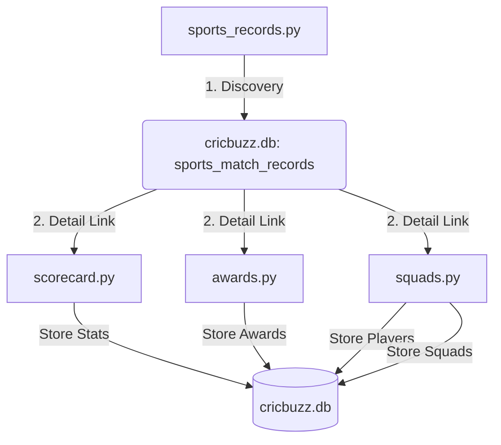
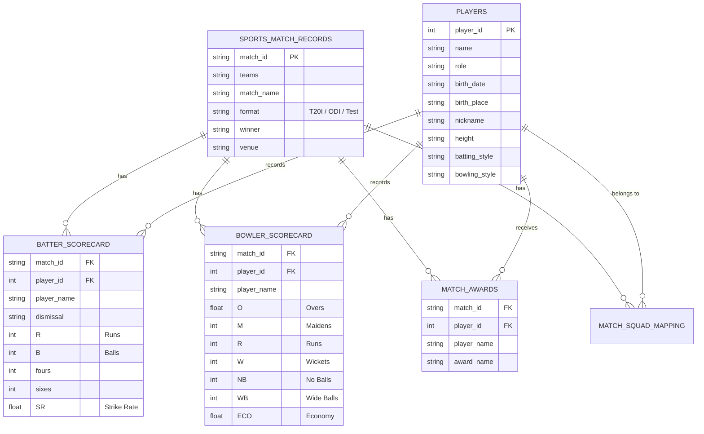

# 🏏 Cricbuzz International Data Crawler

A high-performance, modular Python-based web scraper and ETL pipeline designed for extracting, processing, and storing comprehensive international cricket match data. This project captures everything from match metadata and detailed scorecards to individual player profiles and post-match awards.

---

## 🚀 Key Features

- **Automated Match Discovery**: Dynamically scans for recent international matches (T20I, ODI, Test).
- **Deep Scorecards**: Captures full batting and bowling statistics, including dismissal types, strike rates, and economy.
- **Player Intelligence**: scrapes individual player profiles including birth details, batting/bowling styles, and roles.
- **Relational Storage**: Normalized SQLite database schema to ensure data integrity and query efficiency.
- **Rate-Limited Crawling**: Built-in delays and robust headers to ensure respectful scraping and avoid IP blocking.

---

## 🏗️ System Architecture

### Process Flow


---

## 📊 Database Schema (ER Diagram)

The project utilizes a normalized relational database structure centered around the `match_id`.



---

## 📂 Project Structure

| File | Description |
| :--- | :--- |
| `sports_records.py` | **Master Scanner**. Discovers matches and populates the core match metadata. |
| `scorecard.py` | **Performance Tracker**. Extracts detailed individual stats for batters and bowlers. |
| `awards.py` | **Recognition Parser**. Identifies "Player of the Match" and other accolades. |
| `squads.py` | **Bio Scanner**. Maps squads to matches and fetches full player biographies. |
| `cricbuzz.db` | **SQLite Database**. Permanent storage for all extracted sport data. |
| `requirements.txt` | Dependency list (Requests, BeautifulSoup4). |

---

## 🛠️ Installation & Setup

1. **Clone the repository**:
   ```bash
   git clone <repo-url>
   cd cricbuzz
   ```

2. **Create and activate a virtual environment**:
   ```bash
   python3 -m venv .venv
   source .venv/bin/activate
   ```

3. **Install dependencies**:
   ```bash
   pip install -r requirements.txt
   ```

---

## 🏃 Execution Guide

Run the scripts in the following order to ensure data consistency:

1. **Scan for matches**:
   ```bash
   python sports_records.py
   ```

2. **Populate detailed stats & awards**:
   ```bash
   python scorecard.py
   python awards.py
   ```

3. **Fetch squad info & player profiles**:
   ```bash
   python squads.py
   ```

---

## 🔍 Data Insights

You can query the results directly using SQL:

```sql
-- Find top scorers of the tournament
SELECT player_name, R, match_id 
FROM batter_scorecard 
ORDER BY R DESC LIMIT 10;

-- Identify most frequent Player of the Match winners
SELECT player_name, COUNT(*) as awards 
FROM match_awards 
GROUP BY player_name 
ORDER BY awards DESC;
```

---

## ⚖️ Disclaimer
This project is for educational purposes only. Always comply with [Cricbuzz's Terms of Service](https://www.cricbuzz.com/info/termsofuse) regarding data scraping and usage.
